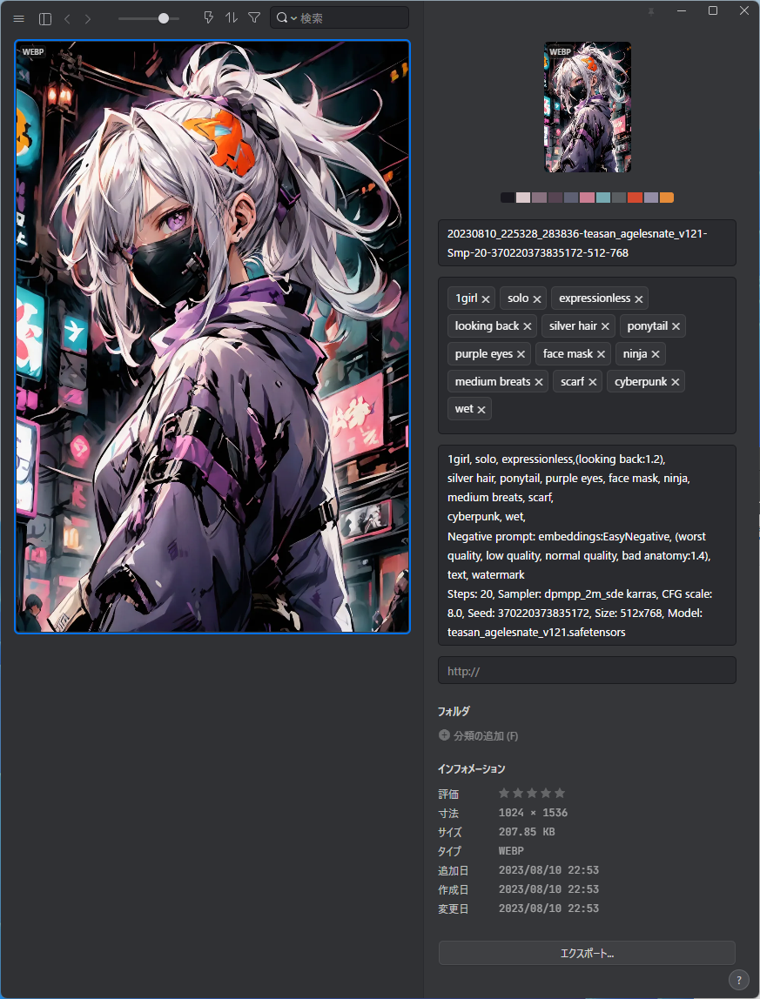

# ComfyUI-send-Eagle
Send the generated images to [Eagle](https://en.eagle.cool/) in webp file format. custom node for [ComfyUI](https://github.com/comfyanonymous/ComfyUI)

## Description
This custom node make subfolder(YYYY-MM-DD) on ComfyUI output directory. 
File naming rule is as follows(my setting in SD-webui A1111).

./ComfyUI/output/YYYY-MM-DD/YYYYMMDD_HHMMss_SSSSSS-{model_name}-Smp-{steps}-{seed}-{FinalImage_width}-{FinalImage_height}.webp

## Install
Use git clone https://github.com/shingo1228/ComfyUI-send-eagle in your ComfyUI custom nodes directory
## Update
1. Navigate to the cloned repo e.g. `custom_nodes/ComfyUI-send-eagle`
2. `git pull`
## How to use
under construction
## Change Log
2023/08/11 Support "CLIPTextEncodeSDXL" node
